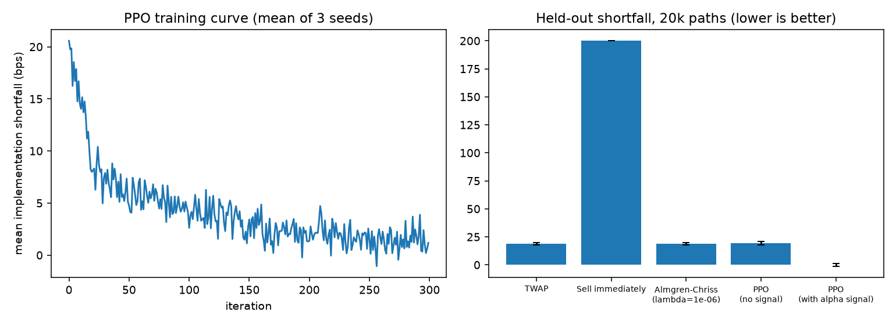

# exec-rl

Optimal trade execution with reinforcement learning: a from-scratch PPO agent (PyTorch) that liquidates a
100,000-share position over 20 steps, benchmarked against TWAP and the Almgren-Chriss schedule on held-out
simulated paths.

## Setup

Market model: Almgren-Chriss linear permanent and temporary impact, per-step Gaussian price noise, plus an
AR(1) **alpha signal** that predicts the next price drift. The agent chooses what fraction of remaining
inventory to sell each step; the reward is the negative implementation shortfall in basis points of arrival
notional.

Two engineering choices that matter:

- **Policy anchored on TWAP.** The network outputs a logit offset from the TWAP slice, so an untrained policy
  equals TWAP and learning only has to find improvements.
- **Low-variance reward.** The shortfall is rewritten by summation by parts so each step's reward carries only
  that step's price noise. The total is identical (a unit test checks it against the closed form), but
  a naive reward that carries the accumulated price history did not learn: PPO finished at 30-38 bps, *worse*
  than TWAP.

## Results (20,000 held-out paths, 3 training seeds)

| Policy | Mean shortfall (bps) | Std |
|---|---|---|
| Sell immediately | 200.0 | 0 |
| TWAP | 18.8 | 83.7 |
| Almgren-Chriss (best risk-aversion on grid) | 18.8 | 80.8 |
| PPO, signal hidden (ablation) | 19.4 | 95.8 |
| **PPO, with alpha signal** | **0.16** (mean of seeds 0.01 / 0.00 / 0.47) | 84.5 |

Paired difference vs TWAP (best seed): -18.8 bps (SE 0.18); the seed mean is about -18.6. Without the signal, PPO matches TWAP and Almgren-Chriss, which
is the correct answer when there is nothing to exploit. Best simple hand-coded signal rule reaches ~1.8 bps, so
the learned policy also beats a hand-tuned linear rule.



## Caveats

The market is simulated and the signal is predictive by construction, so these numbers show the agent learns to
use an alpha signal under impact costs. They are not a claim about live-market performance. The PPO row is the
mean over 3 seeds (an earlier version reported the best seed, chosen on the evaluation paths). `study.py`
sweeps signal strength and impact against a tuned linear signal rule; with a strong signal the simple rule beats PPO.

## Run

```bash
python run.py            # trains 6 agents (~3 min on a laptop CPU), writes results.json and results.png
python -m pytest tests   # 6 tests
```

Requires Python 3.10+, numpy, torch, matplotlib.

## License

MIT
